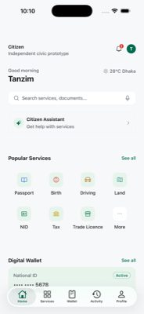
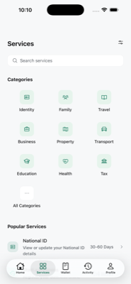
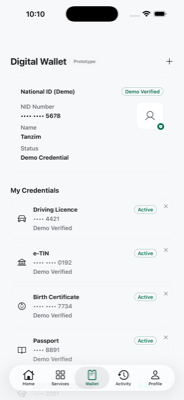
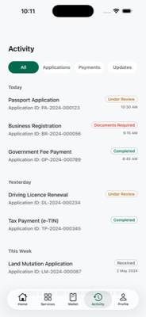

# Citizen

Citizen is an **independent, open-source civic technology prototype** that aims to make  government services easier to find, understand, and complete — passports, national ID, driving licences, land mutation, tax, business registration, and more, organized around what a citizen wants to *do*, not which ministry or office handles it.

> **Citizen is not affiliated with, endorsed by, or connected to the Government of Country.** It has no real government data integration, no live NID verification, and no official partnerships. Every piece of service, fee, and document information in the app today is **sample/demo data** clearly labeled as such, meant to prototype the product experience before any real data source exists.

Built with [Expo](https://expo.dev) (React Native + TypeScript), targeting iOS and Android from one codebase.

**Why this matters:** many people in Bangladesh don't know which office handles a given service, or end up paying unofficial "extra" fees simply because they don't know what the real ones are. Citizen exists to close that information gap with a single, honest, citizen-first entry point.

<p align="center">
  
  
  
  
</p>

---

## Current status

This is an early-stage prototype. What exists today:

- **Home** — search entry point, Citizen Assistant shortcut, quick actions, popular services, wallet preview, recent applications
- **Services** — browse by category, search, full step-by-step guide for every service (requirements, fees, steps, where to apply), a sample multi-step application wizard, and a "Fee Transparency" view comparing official vs. community-reported costs
- **Wallet** — a demo credential wallet (National ID, driving licence, birth certificate, passport, etc.) — explicitly labeled as demo/prototype credentials, not real digital IDs
- **Activity** — application/payment history grouped by date, with status tracking
- **Profile** — language selector (UI only — no real Bangla translation yet), privacy notice, about page, and a Low Data Mode setting
- **Citizen Assistant** — a chat UI shell with suggested questions; **not connected to any AI backend yet** — it clearly tells the user this rather than faking a response

Everything above runs on static, local mock data. There is no backend, no network layer, and no persistence beyond a couple of local device settings.

---

## Getting started

```bash
npm install
npx expo start
```

Then either:
- press `i` to open the iOS Simulator, or
- press `a` to open an Android emulator, or
- scan the QR code with **Expo Go** on a physical device.

This project currently targets **Expo SDK 54** specifically because that's what the App Store build of Expo Go supports — check `package.json` before assuming a newer SDK is safe to adopt without also verifying Expo Go compatibility.

Useful scripts:

```bash
npx tsc --noEmit   # typecheck
npx expo lint      # lint
```

Both should report zero errors before you open a PR.

---

## Project structure

```
src/
├── app/            # Expo Router screens (file-based routing)
│   └── (tabs)/     # the 5 bottom-tab screens: Home, Services, Wallet, Activity, Profile
├── components/
│   ├── home/       # Home-screen-only pieces
│   ├── ui/         # shared, reusable components (rows, badges, headers, icon registry…)
│   ├── navigation/ # bottom tab bar (native + web variants)
│   └── legacy/     # unused Expo-starter leftovers, kept for reference
├── constants/      # design tokens: colors, spacing, radius, category tints
├── data/           # mock data — the only place service/credential/activity content lives
├── types/          # shared TypeScript types
└── hooks/          # theme, color scheme, low-data-mode, etc.
```

Design system: deep Bangladesh green (`#006A4E`) as the primary color, red (`#D93025`) reserved for alerts and meaningful discrepancies, warm neutral background — mostly plain, low-chrome UI in the spirit of mature government/banking apps (Estonia, Singapore's Singpass, Japan's MynaPortal) rather than a generic SaaS dashboard.

---

## Contributing

Contributions are welcome — this is meant to be a community-built reference for what good civic UX could look like for Bangladesh, and it stays a collective, open-source effort: **no contributor can claim ownership of the project as a whole.**

See [`CONTRIBUTING.md`](./CONTRIBUTING.md) for the full guide — code conventions, trust/honesty rules for handling government service info, ownership/attribution terms, and how to submit a PR.

---

## Roadmap / what's not built yet

Roughly in priority order:

1. **Real backend & data layer** — replace `src/data/*.ts` mock arrays with an actual API. Nothing below this point makes sense until real data-fetching exists.
2. **Offline-first caching** — service info (requirements, fees, steps) should be cached locally and remain readable with no internet connection, with a visible "Last verified [date]" timestamp (already implemented on the Service Detail UI, just not yet backed by a real cache/refresh cycle).
3. **Pagination everywhere** — services, applications, and notifications should never be fetched in one giant request.
4. **Low Data Mode, for real** — the toggle exists in Profile today but currently only reduces a splash animation; it should eventually also disable auto-refresh, defer non-essential network calls, and skip large media.
5. **Citizen Assistant backend** — an actual AI integration, strictly optional. Every core flow (search, steps, fees, documents) must keep working with zero LLM involvement, and AI must gracefully fall back to the normal structured guide on poor connectivity rather than showing an error state.
6. **Real Bangla localization** — proper i18n, not just a placeholder toggle.
7. **Accessibility mode** — large text, high contrast, simple Bangla, voice guidance, usable on low-end/basic devices.
8. **Conservative device support** — verified on an older, low-RAM Android emulator, not just modern iPhones. No iOS/Android-exclusive APIs without a fallback.
9. **Assisted-access channels** — SMS, USSD, call-centre, or family-assisted flows for citizens without smartphones.
10. **Real credential wallet** — if this ever integrates with an actual government identity system, it needs a real security/privacy review before any of the current "demo credential" UI is treated as authoritative.

---

## License

MIT — see [`LICENSE`](./LICENSE). *(Note: the current LICENSE file still carries the original Expo template's copyright holder — update this to the project's actual copyright holder before treating it as final.)*

Citizen is and remains open-source under this license. No individual or organization may claim ownership of the project as a whole, relicense it as closed-source, or present a fork as the sole official version — see [`CONTRIBUTING.md`](./CONTRIBUTING.md#ownership--attribution) for details.
